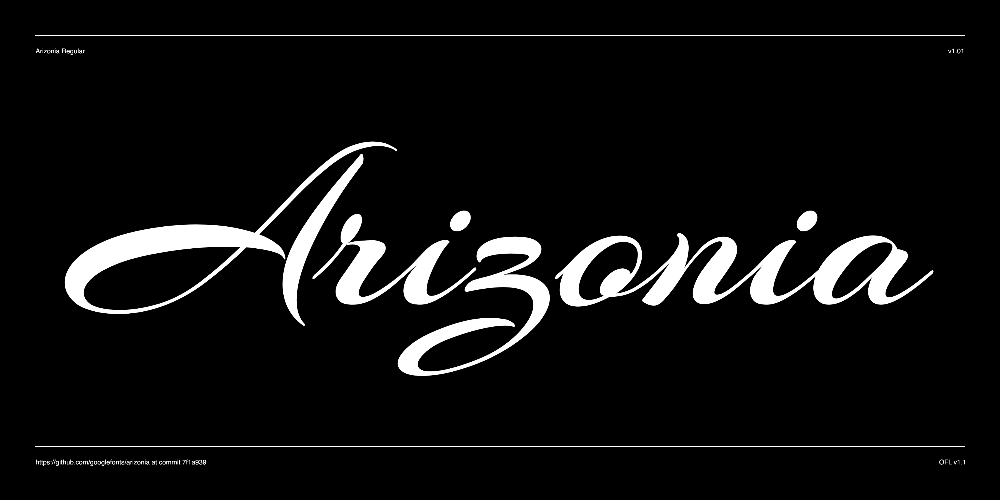

# Arizonia

Arizonia was inspired by the lettering found on a construction truck. It has a sign-painterly look with thick and then contrasts that resembles using a pointed brush. 

It can be used for situations that require a hand lettered, contemporary and sporty feel. As with any script, Arizonia should not be used in ALL Caps.



## Building the Fonts

The font is built using fontmake and gftools post processing script. Tools are all python based, so it must be previously installed.

To install all the Python tools into a virtualenv, do the following:

From terminal:

```

cd your/local/project/directory

#once in the project folder create a virtual environment. 
This step has to be done just once, the first time:

python3 -m venv venv

#activate the virtual environment

source venv/bin/activate

#install the required dependencies

pip install -r requirements.txt

```

Then run the this command:

```
cd sources
gftools builder config.yml
```
